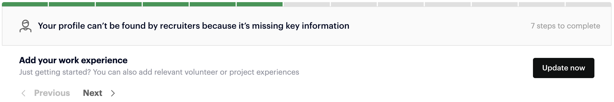

# wellfound-scraper

"Scraper" for the wellfound job board.
It logs in and makes a post request to the api.
For now it only fetches the jobs i'm looking for.

## Usage

Be sure to register on the wellfound website and fill out missing key information in your profile to avoid interruptions.



First, set the email and password in the .env file.

```.env
EMAIL=your_email
PASSWORD=your_password
```

Load the environment variables.

```python
$ python3 example.py

load_dotenv()

email = os.getenv("EMAIL")
password = os.getenv("PASSWORD")
```

Run the script.

```python
client.get_companies(query=[])
```
